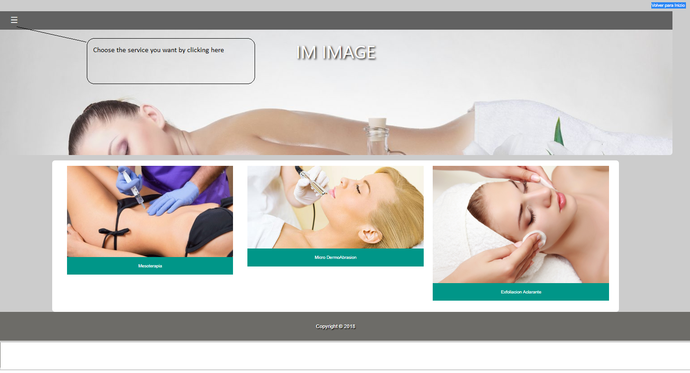
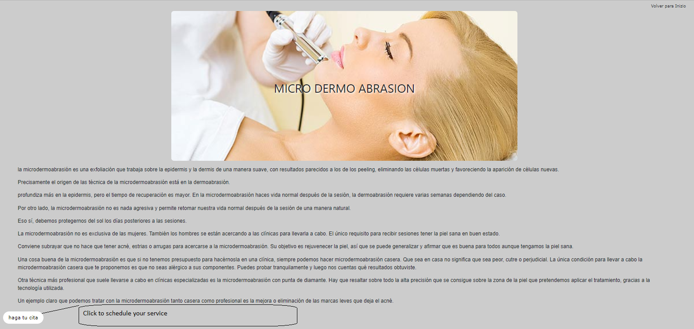
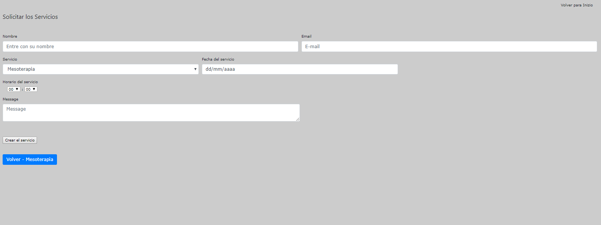

# README

The goal of this app is to schedule some SPA appointments

  -This is a project made with my son. Why do I start writhing it?. Due to the fact that this simple project, made my son got a job offer    in Mexico and his dream come true.

   I know there is a lot of other tools to develop here, but, It's been working

   The important part of it is that it saves a business

   It is a simple agenda that doesn't need even to login in, I insisted to the owner of the business to create a WebApp with at least        login, but he did not want because its customers complained a lot about one more app to log in, even using facebook or google account.
   I tried to convince the customer to use something more beautiful, but, he needed something really simple.

* Ruby version. 2.6.4p104

* No dependencies

* There is a session resource which controls user access

How to use a Test version?. 

link to the main page 
https://limitless-scrubland-08786.herokuapp.com

Main screen.

After choosing the service, the page will be displayed as shown below

Click on the button (Haga tu cita), then, you will see the schedule page.

fill in the fields.

To create new services, this is the link
https://limitless-scrubland-08786.herokuapp.com/services

to see all the schedule
https://limitless-scrubland-08786.herokuapp.com/user_x_services

